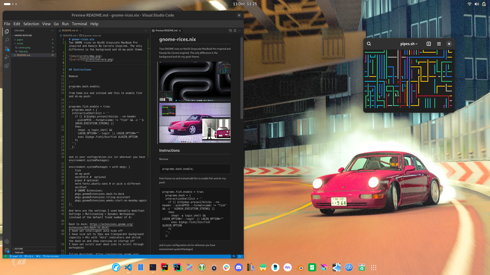
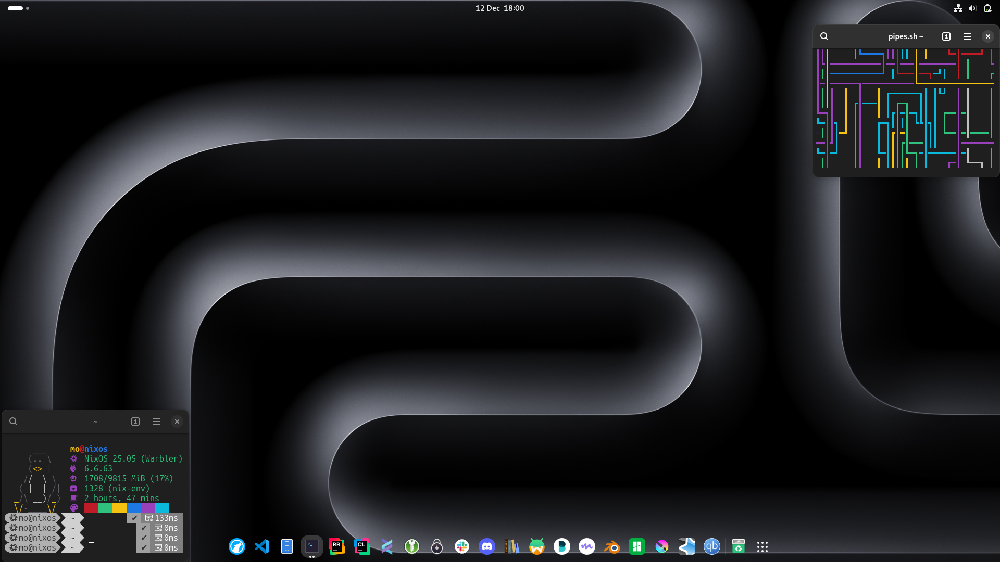
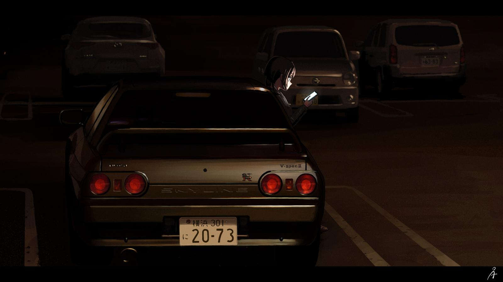
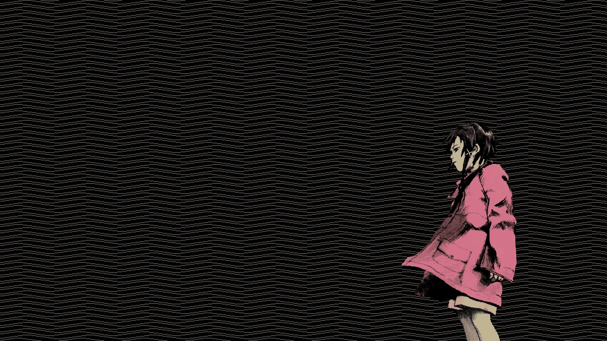
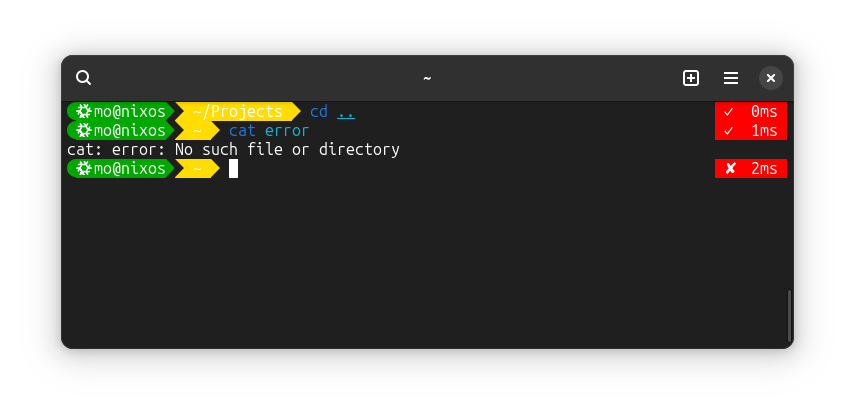

# gnome-rices.nix
Two GNOME rices on NixOS Greyscale MacBook Pro inspired and Kanojo No Carrera inspired. The only difference is the background and oh-my-posh theme.




To have firefox like this in "fullscreen mode" but not take up the full screen go to
about:config search for widgets and change the only option this one:
full-screen-api.ignore-widgets 
to True

Wallpapers available in "papes" folder.




## Instructions

Remove 

```
programs.bash.enable;
``` 
from home.nix and instead add this to enable fish and oh-my-posh:

```
programs.fish.enable = true;
  programs.bash = {
  interactiveShellInit = ''
    if [[ $(${pkgs.procps}/bin/ps --no-header --pid=$PPID --format=comm) != "fish" && -z ''${BASH_EXECUTION_STRING} ]]
    then
      shopt -q login_shell && LOGIN_OPTION='--login' || LOGIN_OPTION=""
      exec ${pkgs.fish}/bin/fish $LOGIN_OPTION
    fi
  '';
  };
``` 

and in your configuration.nix (or wherever you have environment.systemPackages) 
```
environment.systemPackages = with pkgs; [
    fish
    oh-my-posh
    nerdfetch #  optional
    pipes # optional
    nerd-fonts.ubuntu-sans # or pick a different nerdfont
    # GNOME Extensions:
    pkgs.gnomeExtensions.dash-to-dock
    pkgs.gnomeExtensions.tiling-assistant
    pkgs.gnomeExtensions.weeks-start-on-monday-again
];
```
And here are the settings I used manually modified:

Settings > Multitasking > Dynamic Workspaces (instead of the default fixed number of 4)

Dash to dock: https://extensions.gnome.org/extension/307/dash-to-dock/

I have set intelligent auto hide off
I have size set to 32px and transparent background (opacity = 0%) with "dots" indicators and shrink the dash on and show overview on startup off
I have set scroll over dash icon to scroll through workspaces

Tiling Assistant: https://extensions.gnome.org/extension/3733/tiling-assistant/

I have it set to open after window off leave it as the default on if you prefer the windows style but i prefer for it just to snap and nothing else If i want to snap a second program I just switch to that program and drag it too (could've just used keybinds to be honest). I also have raise together off when I select a program I only want that one to show up. And both gaps set to 10px

Transparent Top Bar: https://extensions.gnome.org/extension/3960/transparent-top-bar-adjustable-transparency/

0% opacity (fully transparent).


Oh-my-posh theme is a new file you have to make:
```/home/mo/.config/fish/config.fish```
and
```/home/mo/.poshthemes/themename.omp.json```
Themes can be downloaded [here](https://ohmyposh.dev/docs/themes) or to get the traffic lights one copy it from this repo but it is a WIP though it currently works okay. (Path is not very readable)


Frequently Used Commands:
```
sudo nixos-rebuild switch --flake /etc/nixos#default
```
```
sudo code /etc/nixos --no-sandbox --user-data-dir /home/mo
```


